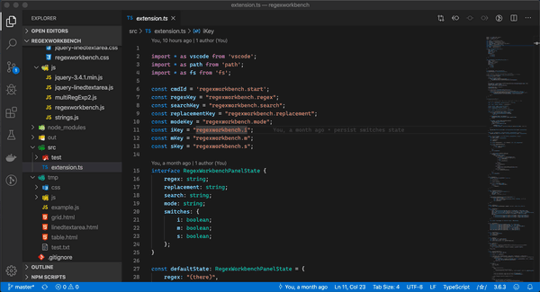

# Preview

## Description

A regular expression workbench for Visual Studio Code in the style of [Komodo's](https://www.activestate.com/products/komodo-ide/).  Just click on the slash-star-slash icon in the lower right.

Currently supports match, match all, split, replace, and replace all.

(Note: only supports JavaScript regular expressions at this time.)

## Sideloading from a local build

Make sure you have Node.js installed, then run:

`npm install -g vsce`

Clone the repo and `cd` into its directory, then run:

`vsce package`

`code --install-extension regexworkbench-<version>.vsix`

(The `version` comes from package.json.)
